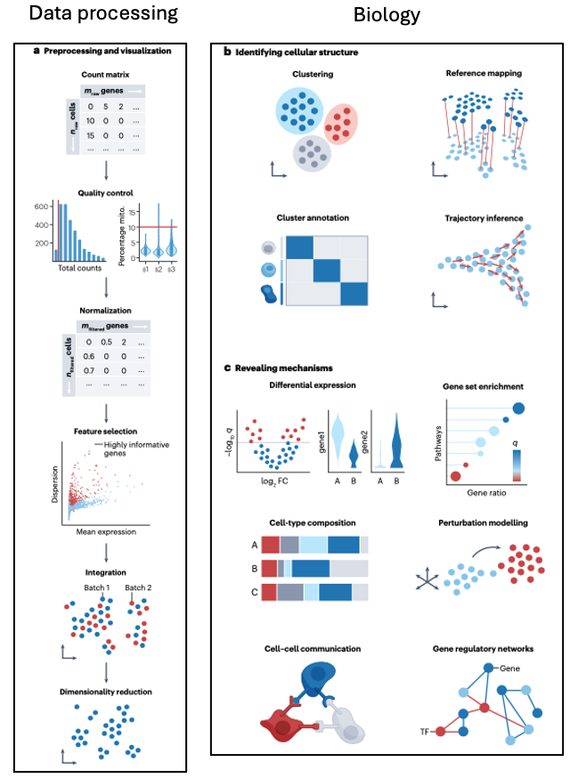
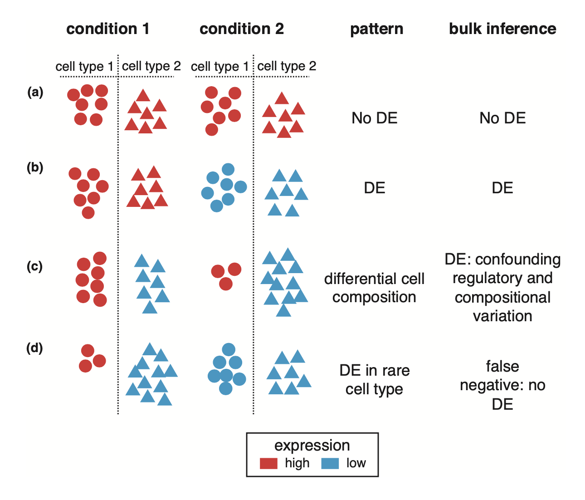
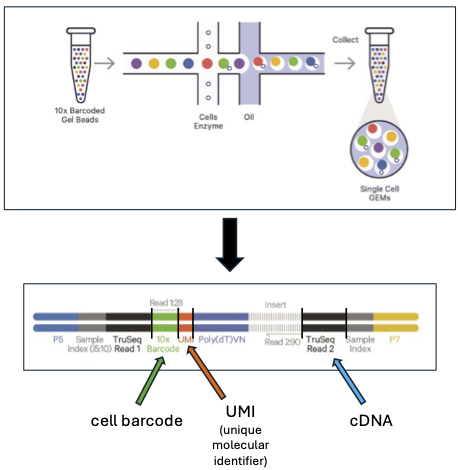
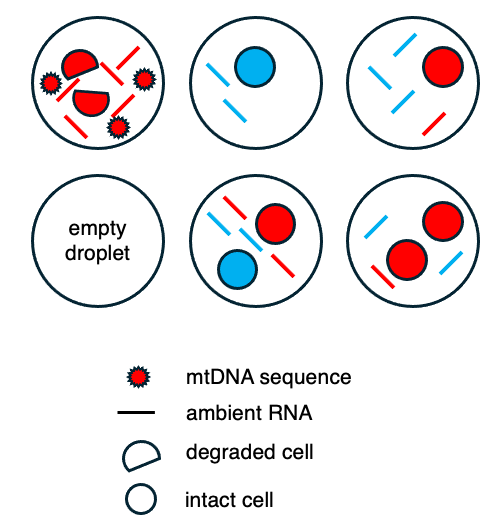
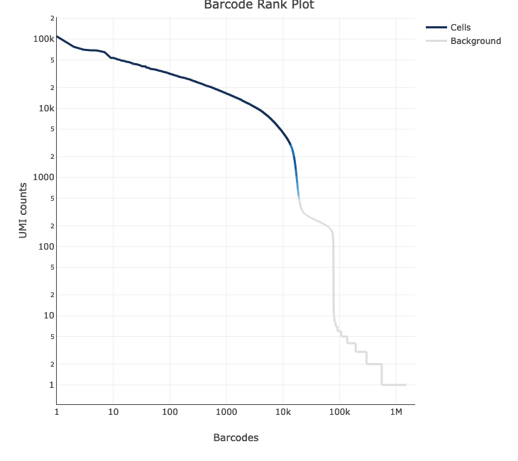

# Introduction to single-cell RNAseq

Welcome to today's workshop on single-cell RNA-seq. Single cell genomics is nothing if not a field moving at warp speed: papers on new data analysis methods and tools are being published all the times, not the mention the myriad empirical papers. In short, don't pay attention for a few months, and you may find yourself racing to play catch up. This workshop is not intended--nor would it be possible in an hour--to cover current methodology. Instead, it is intended to be a gentle introduction to scRNA-seq technology and to impart a broad understanding of the foundations for scRNA-seq analysis. Specifically we will cover:

* Potential benefits of scRNAseq over bulk RNAseq analysis
* Current sequencing technologies (all available at the Bauer Core)
* Artefacts requiring data cleaning
* Base-level QC metrics: stuff reported from instrument-associated software
* scRNAseq data structures
  * sparse matrices, cell barcode and feature tableszero-inflation
* Loading data with the R package Seurat
* Data processing,filtering, and clustering

## What is and why choose single-cell RNAseq?

Single-cell RNA-seq (scRNAseq) is a powerful new approach that has arisen and matured over the last decade. In contrast to bulk RNAseq-- in which sequencing libraries are constructed from tissues or cell populations in a manner that is entirely agnostic to the identities of and expression variation among the constituent cells--scRNAseq involved isolating and labelling individual cells and their constituent RNA molecules. This enables the association of inidiviual cDNAs or RNAs with their cell of origin, such that cell level expression profiles can be constructed. Early scRNAseq technologies were relatively low throughput, producing expression profiles for dozens to hundreds of cell. In contrast, contemprary methodologies now enable the sequencing of thousands to hundreds of thousands of cells.  

A standard scRNAseq workflow involves several data cleaning steps, that then enable a variety of downstream analyses. A broad view of the steps in an analysis is exemplified by:  

<p align="center">



</p>
Adapted from [Heumos et al. 2023, *Nature Biotechnology"](https://www.nature.com/articles/s41576-023-00586-w)


scRNA-seq has the potential to offer deeper insights into a number of research areas including:

* the impact rare cell populations on phenotypes including genetic diseases.
* the role of cell composition change during development.
* cellular responses to environmental perturbations and drug treatment.

While these examples highlight the potential value of scRNAseq in biomedical research and developmental/cell biology, scRNA-seq also has considerable potential for organismal biologists who have historically used bulk RNA-seq to understand expression variation across enviornments and populations, and even among species. Phenotypes observed in laboratory organisms and natural populations are, with the exception of single-celled organism, the product of an assortment of cell types. As a result, both the statistical power of bulk RNA-seq studies and the generality of biological inference are constrained by the inability to account for cell composition variation among samples, even if they are derived from the same tissue. Contrasting differential expression (DE) analysis for bulk and scRNAseq is a useful demonstration of this principle:

<p align="center">



</p>

## Current sequencing technologies
### 10x 3' gene-level analysis with Illumina sequencing
The 10x Genomics 3'assay has become an industry standard, using a gel-droplet technology that allows isolation of indiviual cells in droplets, so that cDNA fragments can be associated with a cell barcode reflecting the cell of origin, and individual RNAs can be associated with unique molecular barcodes (UMIs), which enable computational deduplication to avoid PCR amplification bias.

<p align="center">



</p>
Adapted from ["10x 3' library construction user guide"](https://cdn.10xgenomics.com/image/upload/v1710230393/support-documents/CG000731_ChromiumGEM-X_SingleCell3_ReagentKits_v4_UserGuide_RevA.pdf)

Because the cDNA sequence readout is only from the 3' end, a workflow based upon this technology is only able to produce expression estimates (per cell) at the gene-level. In other words, there is not enough unique sequence to enable alignment of a particular sequencing fragment to a particular alternatively spliced isoform.

### High throughput whole-transcript sequencing
Pacific Biosciences (PacBio) and Oxford Nanopore Technologies (ONT) have recently released competing technologies to achieve high throughput full-length isoform sequencing at single cell resolution. Generally speaking, both approaches take 10x 3' scRNA-seq libraries as input, concatenate the sequencing fragments into larger library fragments, then sequence those fragments on their respective instruments. These approaches embed sequences between the ligated 10x reads, such that after sequencing, the long reads can be computationally segmented into the original (putatively full length) transcript fragments. 
* The PacBio MAS-Seq method is described in [Al'Khafaji et al. 2024, Nature Biotechnology](https://www.nature.com/articles/s41587-023-01815-7), with workflow instructions for generating expression matrices can be found [here](https://isoseq.how/).
* Similarly, ONT has a nextflow workflow that we have implemented successfully on the Cannon cluster that is detailed [here](https://github.com/epi2me-labs/wf-single-cell). 


## Artefacts requiring data cleaning
Despite major advances in scRNA-seq library preparation and sequencing, there remain technical aspects of the technology that generate artefacts and noise that need to be cleaned up prior to conducting any downstream analyses. In an ideal world, each gel droplet from which a sequencing library is constructed will contain a single intact cell and no contaminant RNA. In reality, there are common deviations from that ideal world:

<p align="center">



</p>

In summary one can observe:  

* Droplets with a single, high-quality cell  
* Empty wells without a cell, with the cell-level library component built from free RNA  
* Droplets containing > 1 cell: 2 cells = "doublets", > 2 cells = "multiplets"  
  * doublets and multiplets with > 1 cell type are more problematic than same-type multiplets  
* Degraded low-quality cells will lead to elevated mtDNA sequence fractions
* ambient RNA found across all droplets--both those that are empty and those that contain
  * for droplets containing cells, this ambient RNA does not originate from the cells in the droplet

**An ideal workflow would thus:**
* filter out empty "cells"
* remove ambient RNA contamination effects from counts
* remove doublets/multiplets
* remove droplets that contain low-quality data, e.g. those that contain cells that were already dying/lysing during library preparation

**These filtering steps must be conducted before proceeding with any downstream normalization, clustering, marker gene identification or other biologically informative analyses.**

## Base-level QC metrics
Typical metrics reported as part of *cellranger count* or other instrument-related software include:  

* **the overall read alignment rate.** a low read alignment rate suggests a number of possible problems, e.g. problem with the library construction process, or a mismatch between the taxonomic origin of the sample compared to the reference genome.  
* **the proportion of reads mapping to the transcriptome.** If this rate is low, this suggests possible DNA contamination or an incomplete genome annotation.  
* **sequence saturation.** The proportion of sequenced reads that are duplicates of already sequenced UMIs. Low saturation means that more sequencing will recover additional previously unobserved molecules, while high saturation indicates there is little to be gained by doing additional sequencing of the library.
* **knee plots.** Knee plots plot, in descending order cells ranked by the number of UMIs in that cell, where the cell with the largest number of UMIs has a rank of one, etc. Plotting the rank on the x-axis, ans the number of UMIs on the y-axis leads, pre-filtering, to a sterotypic "knee" pattern, with a steep drop-off in number of UMIs being indicative of a threshold between high-quality cells and low quality cells or empty droplets. This threshold is estimate internally and used to produce the filtered expression matrices.  

<p align="center">



</p>


##scRNAseq data structures
Because sequencing effort is spread across thousands of cells for which expression is estimated for tens of thousands of features, scRNAseq matrices are sparse, meaning that there are lots of small counts, and more importantly, lots of zero counts. The resulting count matrices are often referred to as "zero-inflated", leading to debate about the sources of zero-inflation, and whether the counts are in fact zero-inflated. Relevant papers to look at are [Jiang et al. 2022, *Genome Biology*](https://genomebiology.biomedcentral.com/articles/10.1186/s13059-022-02601-5), and [Svensson 2022, *Nature Biotechnology*](https://www.nature.com/articles/s41587-019-0379-5). Wherever the consensus ultimately lands on the statistical front, pratically speaking, the count matrices are comprised of rows that represent features (either gene ids or isoform ids), and columns that represent cells.

## Constructing a workflow (at least the initial part of it!)

### 1. Setup
### automated package install
```{r,echo=FALSE}
installed_packages <- rownames(installed.packages())
for (pkg in c("tidyverse", "patchwork", "sctransform","SoupX",
                "cowplot")) {
  if (!pkg %in% installed_packages) {
    install.packages(pkg, quiet = TRUE)
  }
  library(pkg, character.only = TRUE)
}
  
if (!require("BiocManager", quietly = TRUE))
    install.packages("BiocManager")


BiocManager::install(c("glmGamPoi", "scDblFinder","scater"))
```

#### library load
```{r,echo=FALSE}
library(Seurat)
library(patchwork)
library(sctransform)
library(tidyverse)
library(SoupX)
library(cowplot)
library(glmGamPoi)
library(scDblFinder)
library(scater)


data_dir=getwd()
```

```{r,echo=FALSE}
download.file("https://cf.10xgenomics.com/samples/cell-exp/2.1.0/pbmc4k/pbmc4k_raw_gene_bc_matrices.tar.gz", 
    destfile = file.path(data_dir, "tod.tar.gz"))
download.file("https://cf.10xgenomics.com/samples/cell-exp/2.1.0/pbmc4k/pbmc4k_filtered_gene_bc_matrices.tar.gz", 
    destfile = file.path(data_dir, "toc.tar.gz"))
untar(file.path(data_dir, "tod.tar.gz"), exdir = data_dir)
untar(file.path(data_dir, "toc.tar.gz"), exdir = data_dir)
```

### Load data with Seurat 10x data loader
```{r}
sc_data_raw <- Seurat::Read10X(file.path(data.dir = data_dir,"raw_gene_bc_matrices","GRCh38"))
sc_data_filtered <- Seurat::Read10X(file.path(data.dir = data_dir,"filtered_gene_bc_matrices","GRCh38"))                              
```

If we take a quick look at the dimensions of the filtered matrix, we see that:
```{r}
dim(sc_data_filtered)
```
there are 33694 genes an 4340 cells in the data set.

### Ambient RNA decontamination
Tools to correct counts for droplets deemed to contain cells involve two steps:
* estimating the ambient "soup" from putatively empty droplets, and 
* using the estimate of the soup to subtract it from droplets containing cells.


We are using [SoupX](https://academic.oup.com/gigascience/article/9/12/giaa151/6049831) to detect and correct counts for contamination for ambient RNA. SoupX corrects contamination as follows:
* for each cell cluster identify "non-expressed genes"
* for each of those non-expressed genes,calculate a likelihood of a contamination fraction given a particular contamination rate estimate
* perform those calculations across all non-expressed genes and clusters, and generate a single maximum likelihood estimate of the contamination fraction
* Use the MLE estimate of contaminant fraction, the abundance of each gene in the "soup" (including all genes, not just the cell cluster non-expressed genes), and the cell-specific library sizes to correct counts for individual cell barcodes.


Because SoupX requires information on clusters, we must perform a provisional clustering analysis, knowing that we will re-cluster the data once all filtering and cleanup of the data has been finished. Another important thing to note is that rather than the traditional way of normalizing count data, were are using a new and improved normalization method called *SCtransform*, described in [Hafemeister and Satija 2019, *Genome Biology*](https://genomebiology.biomedcentral.com/articles/10.1186/s13059-019-1874-1), conveniently available in Seurat.

#### Initialzing the Seurat object, and performing clustering analysis
```{r}
seurat_obj <- CreateSeuratObject(counts = sc_data_filtered)
seurat_obj <- PercentageFeatureSet(seurat_obj, pattern = "^MT-", col.name = "percent.mt")
seurat_obj <- SCTransform(seurat_obj, vars.to.regress = "percent.mt", verbose = FALSE)
seurat_obj <- RunPCA(seurat_obj, verbose = FALSE)
seurat_obj <- RunUMAP(seurat_obj, dims = 1:30)
seurat_obj <- FindNeighbors(seurat_obj, dims = 1:30)
seurat_obj <- FindClusters(seurat_obj)
```
#### make UMAP plot of data without ambient RNA decontamination
```{r}
unfiltered_umap_plot<-DimPlot(seurat_obj, label = TRUE) + ggtitle("Unfiltered")
unfiltered_umap_plot
```


#### A quick note about metadata
Metadata in a Seurat object comprise information regarding the cells, i.e. barcodes recovered in the sequencing experiment. 
Default metadata are:  
1. nCount_RNA, the number of unique RNAs in the cell (equivalent to the number of UMIs), and  
2. nFeature_RNA, which is the number of genes for 3' 10x sequencing.  

One can add additional metadata such as the percent of UMIs that originate from mtDNA, which we will do later, but there is no need since this isn't the final version of the data. But, notice that normalization and clustering has led to additional metadata being added:  

```{r}
head(seurat_obj@meta.data)
```

Note: one can also access the metadata with `seurat_obj[[]]`.

#### Running SoupX
```{r}
soup_channel <- SoupX::SoupChannel(tod = sc_data_raw,toc=sc_data_filtered,
                is10X = TRUE)
soup_channel$tod<-sc_data_raw
soup_channel <- SoupX::setClusters(soup_channel, 
                                   clusters = as.factor(Idents(seurat_obj)))
soup_channel <- setDR(soup_channel, 
                DR=Seurat::Embeddings(seurat_obj, "umap"))
soup_channel <- autoEstCont(soup_channel)
```
**NOTE:** the labelling on the above plot is slighty confusing because Bayesian methods are not used to estimate rho, the contamination fraction. The "prior" is actually the combined density of all the non-expressed gene x cell cluster estimates of the contaminant fraction, while the "posterior" is the joint likelihood function fitted to the data.

#### Create new Seurat object with corrected counts
We can update the counts to the corrected ones, then save the raw counts to a raw_counts attribute.
```{r}
corrected_counts <- adjustCounts(soup_channel,roundToInt=TRUE)
seurat_obj_filt <- CreateSeuratObject(counts = corrected_counts)
```

### Re-process corrected count data
```{r}
seurat_obj_filt <- PercentageFeatureSet(seurat_obj_filt, pattern = "^MT-", col.name = "percent.mt")
```

#### Visualize QC metrics as a violin plot
Because clustering information is now embedded in the seurat object, it is not possible using default Seurat functions to produce a global violin plot without it being grouped by cluster id. Therefore, we can just use tidyverse functions to make some prettier plots!

```{r}
violindata<-tibble(nCount_RNA = seurat_obj_filt@meta.data$nCount_RNA, nFeature_RNA = seurat_obj_filt@meta.data$nFeature_RNA, percent.mt = seurat_obj_filt@meta.data$percent.mt)
colnames(violindata)<-c("nCount_RNA","nFeature_RNA","percent.mt")
ncount_violin<- violindata %>% ggplot(aes(x=1,y=nCount_RNA)) + geom_violin() + xlab("")
nfeat_violin<- violindata %>% ggplot(aes(x=1,y=nFeature_RNA)) + geom_violin() + xlab("")
mt_violin<- violindata %>% ggplot(aes(x=1,y=percent.mt)) + geom_violin() + xlab("")
plot_grid(ncount_violin,nfeat_violin,mt_violin, ncol=3, nrow=1)
```
                  
#### Bi-plots of metadata relevant to QC
```{r}
mtvsnc<- violindata %>% ggplot(aes(x=log10(nCount_RNA),y=percent.mt)) + geom_point(alpha=0.2,size=1)
nfvsnc<- violindata %>% ggplot(aes(x=log10(nCount_RNA),y=nFeature_RNA)) + geom_point(alpha=0.2,size=1)
plot_grid(mtvsnc,nfvsnc, ncol=2, nrow=1)
```

### Doublet removal
From a recent review, the top-performing doublet detection method was found to be [scDblFinder](https://f1000research.com/articles/10-979/v2). Like most doublet detection methods, *scDblFinder* simulates doublets, performs dimensionality reduction on the joint (simulated doublets + real data), and classifies droplets as singlets or multiplets based upon their neighborhood relationships with simulated doublets in the low-dimensional embedding space: cells with many simulated doublet neighbors are classified as doublets, those distant from the simulated doublets in that space are classified as singlets.

*scDblFinder* cannot take a *seruat* object as input. The object must first be converted to a `SingleCellExperiment` object.

#### convert to an SCE
```{r}
sce_obj_filt <- as.SingleCellExperiment(seurat_obj_filt)
```

#### run scDblFinder
*scDblFinder* has parameter options you can change, and particularly relevant is `dbr`, which is the expected doublet rate. However, the developers indicate *"For 10x data, it is usually safe to leave the dbr empty, and it will be automatically estimated. (If using a chip other than the standard 10X, you might have to adjust it or the related dbr.per1k argument."*

```{r}
sce_obj_filt <- scDblFinder(sce_obj_filt)
```

The doublet classification information is now stored in `scDblFinder.class` in the SCE object.

```{r}
head(colData(sce_obj_filt))
```
Three types of information are provided on droplets:
1. *scDblFinder.class*, the classification of the droplet *scDblFinder* made
2. *scDblFinder.score*, the proportion of nearest-neighbor cells that are simulated doublets, i.e. an estimate of the probability that the cell is a doublet
3. *scDblFinder.weighted*, an adjusted version of the *scDblFinder.score* that accounts for the estimated doublet rate.

If desired, the scores faciliate fine-grained tuning of thresholds after iterations of data exploration. For the purposes of this workshop, we will simply add the *scDblFinder.class* data to the seurat object and filter in on that classification.

```{r}
seurat_obj_filt$scDblFinder.class <- colData(sce_obj_filt)$scDblFinder.class
seurat_obj_filt_singlets <- subset(seurat_obj_filt, subset = scDblFinder.class == "singlet")
cat(paste("The number of cells before doublet removal: ",dim(seurat_obj_filt)[2],"\n"))
cat(paste("The number of cells after doublet removal: ",dim(seurat_obj_filt_singlets)[2]))
```

### post hoc filtering
While computational methods to remove empty droplets and detect doublets enable flagging and filter out of barcodes that can negatively impact downstream analysis, it is likely that a number of droplets will remain in the data set that should probably be removed, in particular
* doublets that did not get flagged by *scDblFinder*
* low quality or dying cells
* droplets that by virtue of the stochastic nature of sequencing generated few UMIs and contained few detectable genes

Low quality cells are often indicated by both low UMI (and feature) counts, particularly after ambient RNA removal, and a high percentage of UMIs assigned to mtDNA genes.

There are two approaches for post hoc filtering:
1. outlier detection, and
2. manual thresholding

#### outlier detection
Following the [Orchestrating Single-Cell Analysis with Bioconductor, aka OSCA](https://bioconductor.org/books/release/OSCA/), for outlier detection we perform adaptive filtering using the median absolute deviation (MAD) statistic, filtering out:
* cells with  % mtDNA > 3 MADs above the median
* cells with UMI count > 3 MADs below the median
* cells with gene count > 3 MADs below the median

For the seurat object, we have to:
* convert it to an *SingleCellExperiment* object
* get list of mtDNA genes (which we've already done)
* call `perCellQCMetrics`
* flag cells that are > 3 MADs above the median mtDNA % using the `isOutlier` function
* filter out cells that are flagged with `isOutlier`
* add log-normalized counts to the object
  * this is done because the `as.Seurat` function that converts an SCE looks for these counts in the data slot and will throw an error if it can't find them
* convert the SCE back to a seurat object

```{r}
sce_filt_singlets <-as.SingleCellExperiment(seurat_obj_filt_singlets)
mito_genes <- grep("^mt-", rownames(seurat_obj_filt_singlets), value = TRUE)
qc <- perCellQCMetrics(sce_filt_singlets, subsets = list(Mito = mito_genes))
# 1. High %mtDNA outliers
high_mito <- isOutlier(qc$subsets_Mito_percent, type = "higher") # TRUE for outliers (high %mtDNA)
cat(paste("The number of cells with high mtDNA %: ",sum(high_mito)))
# 2. Low UMI count outliers (library size is 'sum')
low_counts <- isOutlier(qc$sum, type = "lower") # TRUE for outliers (low total UMI count)
cat(paste("The number of cells with low UMI counts %: ",sum(low_counts)))
# 3. Low feature count outliers ('detected')
low_features <- isOutlier(qc$detected, type = "lower") # TRUE for outliers (low detected features)
cat(paste("The number of cells with low # of genes recovered %: ",sum(low_features)))
```

While this data set did not contain any statistically detectable outliers based upon MAD, if they had been detected, one would proceed as follows:
```{r,eval=FALSE}
discard <- high_mito | low_counts | low_features
cells_to_keep <- colnames(seurat_obj_filt_singlets)[!discard]
seurat_obj_filt_singlets <- subset(seurat_obj_filt_singlets, cells = cells_to_keep)
```

One can then apply additional manual filters that typically used.
```{r}
seurat_obj_filt_singlets_posthocfilt <- subset(seurat_obj_filt_singlets,subset = nFeature_RNA > 200 & nCount_RNA > 500 & percent.mt < 5)
```

We reduced the data set to 3612 cells,filtering out approximately 17% of the input cells. We can now perform clustering on the filtered data.

### Re-running clustering with corrected data

```{r}
seurat_obj_filt_singlets_posthocfilt <- SCTransform(seurat_obj_filt_singlets_posthocfilt, vars.to.regress = "percent.mt", verbose = FALSE)
seurat_obj_filt_singlets_posthocfilt <- RunPCA(seurat_obj_filt_singlets_posthocfilt, verbose = FALSE)
seurat_obj_filt_singlets_posthocfilt <- RunUMAP(seurat_obj_filt_singlets_posthocfilt, dims = 1:30)
seurat_obj_filt_singlets_posthocfilt <- FindNeighbors(seurat_obj_filt_singlets_posthocfilt, dims = 1:30)
seurat_obj_filt_singlets_posthocfilt <- FindClusters(seurat_obj_filt_singlets_posthocfilt)
```
### save the filtered Seurat object for part 2 of workshop
```{r}
saveRDS(seurat_obj_filt_singlets_posthocfilt, file = "pbmc4k_seurat_obj_filt_singlets_posthocfilt.rds")
```

#### make UMAP plot of filtered data
```{r}
filtered_umap_plot<-DimPlot(seurat_obj_filt_singlets_posthocfilt, label = TRUE) + ggtitle("Filtered")
plot_grid(unfiltered_umap_plot,filtered_umap_plot,ncol=2,nrow=1)
```
### cluster similarity heatmap
```{r}
# Define the Jaccard similarity function
jaccard_similarity <- function(set1, set2) {
  intersect_length <- length(intersect(set1, set2))
  union_length <- length(set1) + length(set2) - intersect_length
  return((intersect_length / union_length))
}
```

```{r}
clusters_unfilt<-tibble(cellbarcode=row.names(seurat_obj@meta.data),clusterid_unfilt=seurat_obj@meta.data$seurat_clusters)
clusters_filt<-tibble(cellbarcode=row.names(seurat_obj_filt_singlets_posthocfilt@meta.data),clusterid_filt=seurat_obj_filt_singlets_posthocfilt@meta.data$seurat_clusters)

clusters_merged <- full_join(clusters_unfilt,clusters_filt,by="cellbarcode")
unique_unfilt <- unique(clusters_merged$clusterid_unfilt)
unique_filt <- unique(clusters_merged$clusterid_filt)
```

```{r}
##### Precompute indices for each cluster to avoid recalculating
unfilt_indices <- split(1:nrow(clusters_merged), clusters_merged$clusterid_unfilt)
filt_indices <- split(1:nrow(clusters_merged), clusters_merged$clusterid_filt)

##### Create an empty list to store results
jaccard_list <- list()

##### Calculate Jaccard distances and store them directly in a list
for (i in names(unfilt_indices)) {
  for (j in names(filt_indices)) {
    set1 <- unfilt_indices[[i]]
    set2 <- filt_indices[[j]]
    similarity <- jaccard_similarity(set1, set2)
    
    # Append result as a named list
    jaccard_list[[length(jaccard_list) + 1]] <- list(
      unfilt = i,
      filt = j,
      jaccard_similarity = similarity
    )
  }
}

#### Convert the list to a data frame
jaccard_df <- do.call(rbind, lapply(jaccard_list, as.data.frame))

#### Convert columns to appropriate types
jaccard_df <- type.convert(jaccard_df, as.is = TRUE)
```

#### make heatmap of jaccard similarities
```{r}
unfiltVsfilt_heatmap_plot <- ggplot(data = jaccard_df, aes(unfilt, filt, fill = jaccard_similarity)) +
  geom_tile(color="black") +
  #theme_classic() +
  scale_fill_gradient(low ="white",high = "firebrick",breaks=seq(0,1,0.2)) +
  scale_y_continuous(breaks=seq(0,sum(is.na(unique_filt)==FALSE)-1,1)) +
  scale_x_continuous(breaks=seq(0,sum(is.na(unique_unfilt)==FALSE)-1,1)) +
  labs(title = "Filtered vs. unfiltered cluster similarity",fill = "Jaccard Similarity") +
  xlab("Unfiltered clusters") +
  ylab("Filtered clusters") +
  theme_minimal() +
  theme(
    panel.grid.major = element_blank(),  # Remove major grid lines
    panel.grid.minor = element_blank(),  # Remove minor grid lines
    panel.background = element_blank()   # Remove any panel background color
  ) +
  theme(axis.text.x = element_text(size=10),axis.text.y = element_text(size=10)) +
   theme(
  axis.text.x = element_text(margin = margin(t = -8)),  # Move x-axis labels closer
  axis.text.y = element_text(margin = margin(r = -12))   # Move y-axis labels closer
) +
theme(axis.title.x=element_text(size=14),axis.title.y=element_text(size=14))
unfiltVsfilt_heatmap_plot
```
A few notable observations can be made about the similarity plot:
1. there is a high prevalence of one-to-one strong similarity between unfiltered and filtered clusters, but
2. filtering led to the splitting of an unfiltered cluster into two distinct clusters. This is expected when one removed ambient RNA contamination and heterotypic doublets that can weaken differentiation between clusters.

In summary, filtering matters!

## Future directions
In our subsequent scRNA-seq workshop next week, we will dive into downstream analysis including:
* identifying marker genes for clusters
* multi-sample integration
* differential expression testing across samples
