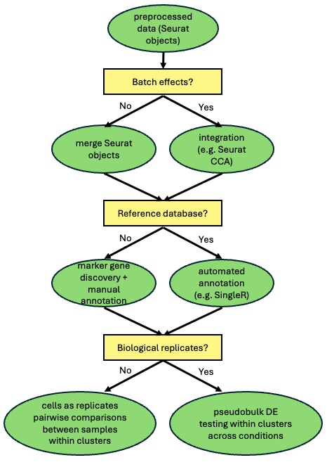

# Introduction to single-cell RNAseq: part2: moving beyond clustering

**Welcome to part 2 of the workshop on single-cell RNA-seq!**

### Recap of part 1

Last week we covered: 

* potential benefits of scRNAseq over bulk RNAseq analysis
* current sequencing technologies (all available at the Bauer Core)
* artefacts requiring data cleaning
* base-level QC metrics: stuff reported from instrument-associated software
* scRNAseq data structures
  * sparse matrices, cell barcode and feature tables,zero-inflation
* loading data with the R package Seurat
* data processing,filtering, and clustering

Specifically with respect to data pre-processing and clustering using a
publicly available human PBMC data set as an example, we: 

* created Seurat objects for our raw and unfiltered count matrices
* in Seurat, normalized the filtered counts with the SCTransform method
* did a preliminary clustering of cells in the filtered data
* removed ambient RNA contamination with *SoupX*, taking as input
  * raw counts
  * filtered counts
  * provisional clusters from the filtered Seurat object
* removed doublets with scDblFinder
* did threshold-based removal of low UMI count, low feature (gene) count, and high mtDNA% cells

### Today, we will cover: 

* using the PBMC dataset,demonstrate how to identify marker genes for cell clusters
* demonstrate one approach for annotating cell types in the PBMC data set using a reference database
* multi-sample analysis using mouse brain data
  * simple merging versus batch effect correction with sample integration
    * metrics for determining whether integration is necessary
* differential expression analysis within cell clusters across conditions

<p align="center">



</p>


## Load/install libraries and set working directory

These will have to be installed in order to run this R markdown file.


```{r,message=FALSE}
installed_packages <- rownames(installed.packages())
for (pkg in c("Seurat", "tidyverse", "patchwork", "sctransform","SoupX",
                "cowplot","metap")) {
  if (!pkg %in% installed_packages) {
    install.packages(pkg, quiet = TRUE)
  }
  
  library(pkg, character.only = TRUE)
}

if (!require("BiocManager", quietly = TRUE))
    install.packages("BiocManager")

for (pkg in c("glmGamPoi", "scDblFinder", "scater", "SingleR","celldex",
                "multtest")) {
  if (!pkg %in% installed_packages) {
    BiocManager::install(pkg)
  }
  
  library(pkg, character.only = TRUE)
}
```

```{r}
data_dir=getwd()
setwd(data_dir)
```

## Marker gene discovery

For much of the history of scRNA-seq, a standard part of data analysis workflows has been the identification of genes that are canonical markers for cell clusters. Lists of marker genes are a necessary prerequisite for any attempt at manual annotation of clusters, e.g. if you have prior information that a set of genes are highly up-regulated in a particular cell type--information obtained from, for example, bulk RNA-seq on sorted cells of that type--one can provisionally infer that a cluster of cells within similar up-regulation of that set of genes belong to that cell type. Detecting marker genes for clusters involves performing tests of differential expression between sets of cells of interest. Detecting marker genes for a particular cluster involves treating cells as replicates and testing for differential expression between cells in the cluster of interest and all other cells. To demonstrate this, we will load up the filtered *pbmc* Seurat object we saved in part 1 of this workshop:

```{r,warning=FALSE}
pbmc_filtered_seurat <- readRDS("data/pbmc/pbmc4k_seurat_obj_filt_singlets_posthocfilt.rds")
filtered_umap_plot<-DimPlot(pbmc_filtered_seurat, label = TRUE) + ggtitle("Filtered")
filtered_umap_plot
```

### Find all marker genes for cluster 8

In this case, marker genes are identified by looking for DE between
cluster 8 and the aggregation of all other clusters. With Seurat, the
standard syntax is to specify an *identity*, such that if only one is
supplied, testing is done for cluster specific genes.

```{r,warning=FALSE}
cluster8.markers <- FindMarkers(pbmc_filtered_seurat, ident.1 = 8)
head(cluster8.markers, n = 5)
```

The default DE test method is the Wilcoxon Rank Sum test, although several other methods are available. It is worth looking at the help for the `FindMarkers()` function to determine whether other changes to default settings are appropriate for your data. *pct.1* and *pct.2* specify the fraction of cells expressing the gene in cluster 8 (i.e. *ident.1*) and all other cells, respectively, and log-fold change is with cluster 8 in the numerator, i.e. positive numbers indicate up-regulation in cluster 8. *p_val_adj* is the p-value adjusted for multiple comparisons using the Bonferroni method. Clearly, the top 5 genes are expressed in the majority of cluster 8 cells, and very few cells from all other clusters.

The above implementation of `FindMarkers()` includes genes that are both up and down-regulated in cluster 8, i.e.

```{r}
downreg_cluster8_markers <- subset(cluster8.markers,avg_log2FC<0)
head(downreg_cluster8_markers,n=5)
```

One can also provide the option to only look for genes up-regulated in the cluster of interest, by supplying the `only.pos = TRUE` keyword argument in `FindMarkers()`. If one wants to simultaneously find makers for all clusters, you can instead use the `FindAllMarkers()` function. **NOTE**: this will take a lot of time to run.

Finally, one can supply more than one identity to focus on genes that distinguish different clusters (or groups of clusters). Looking at our UMAP plot, we might be interested in knowing which genes have expression patterns that distinguish clusters 2 from 4:

```{r}
cluster2Vs4.markers <- FindMarkers(pbmc_filtered_seurat, ident.1 = 2, ident.2=4)
head(cluster2Vs4.markers, n = 5)
```

or genes whose expression distinguish clusters 1 and 12 from 9:

```{r}
cluster1.12Vs9.markers <- FindMarkers(pbmc_filtered_seurat, ident.1 = c(1,12), ident.2=9)
head(cluster2Vs4.markers, n = 5)
```

**REMEMBER**: what you supply to *ident.1* will be the numerator in log-fold change calculations, and will be the up-regulated cluster(s) when LFC > 0 (and the down-regulated cluster when LFC < 0).

## Celltype annotation: beyond marker genes

Manual annotation of cell clusters is a time-consuming process, that also requires a great deal of expertise. To the extent that both requiring the leveraging of considerable expertise to annotate cell types, manual annotation is not much different from creating a cell atlas! Increasingly however, annotation of cell clusters observed in scRNA-seq data can be carried out with computational tools. These tools typically take as input your expression data (in R either a Seurat or SingleCellExperiment object), and the specification of a reference. The reference data set contains expression data for individual cells and cell type labels. In other words, your data are the query which is aligned to the reference such that cell type labels can be transferred from reference cells to the query cells that share a similar expression pattern. Of course, for this approach to work, there must be consistency between the gene symbols in the query and the reference databases.

### Annotating the PBMC dataset

We will demonstrate one method `SingleR`, for annotating cells in our filtered PBMC dataset (which we have already loaded as an *Rds* objects at the start of today's workshop.

#### Load the reference data set

The MonacoImmuneData is a comprised of normalized expression data from 114 bulk RNA-seq experiments on sorted immune cell populations, relevant for annotating immune cells such as PBMCs. We load it as follows:

```{r}
reference <- celldex::MonacoImmuneData()
```

#### Bookkeeping

We found there can be issues with running `celldex` if the cache directory doesn't exist. If loading the referenceSo, we attempt to clear the cache, and in the console type `yes` if we are informed it doesn't exist and do we want to create it:

```{r,eval=FALSE}
library(ExperimentHub)
eh <- ExperimentHub()
removeCache(eh)
```

And if you want more information, use help!

```{r,eval=FALSE}
help(MonacoImmuneData)
```

#### Convert our pbmc data to an SCE object

```{r,warning=FALSE,message=FALSE}
sce <- as.SingleCellExperiment(pbmc_filtered_seurat)
```

#### Run SingleR

```{r}
pred <- SingleR(test = sce, ref = reference, labels = reference$label.main)
```

#### Add predicted cell type labels to our data

```{r}
pbmc_filtered_seurat$SingleR.labels <- pred$labels
table(pbmc_filtered_seurat$SingleR.labels)
```

The labels can now be accessed via: 

* `pbmc_filtered_seurat$SingleR.labels` or
* `pbmc_filtered_seurat@meta.data$SingleR.labels`

### a peek at cluster labels and annotations

```{r}
pbmc_annots_umap<-DimPlot(pbmc_filtered_seurat, group.by = "SingleR.labels", label = FALSE) +
  ggplot2::ggtitle("Cell annotations")
plot_grid(filtered_umap_plot,pbmc_annots_umap,ncol=2,nrow=1)

```

Note that our clustering reveals finer grained subdivision than is implied simply by the cell type annotations. This can be caused by multiple sources, including: 

* coarser resolution of the cell type reference database
* missing cell types
* not able to distinguish subtypes
  * for example, our annotation does not specify memory and naive CD4+T subtypes
* clustering algorithm over-splitting of functional cell types

### Conclusions, caveats and future directions for cell type annotation

* choosing between manual and automated annotation depends upon the availability and quality of a taxonomically and functionally relevant reference database
  * the reference database should be:
    * derived from similar tissues that will contain homologous cell types
    * consist of expression data for genes with substantial overlap with the set of genes expressed in the query
  * for model organisms, there are frequently high-quality atlas-quality references
  * for non-model organisms, mapping to the reference of another species will:
    * be impacted by evolutionary divergence, and there are questions about how the history of gene duplication and loss during intervening speciation events will impact accurate assignment of cell types
    * require reconciling different gene symbols
* building a reference database for annotating cell types is a non-trivial challenge
* some "current" tools may not be adequately maintained and hard to implement
  * the Seurat Azimuth method no longer appears to work, likely due to outdated reference file specifications
  * "best practice" for cell type annotation and is an area of active development
  * we expect that AI-based/transformer methods will likely factor prominently in the future

```{r,echo=FALSE}
rm(list = ls())
```

## Merging, integrating and DE analysis

As we have demonstrated above, marker gene discovery for cell clusters *within* a sample is straightforward and is based upon testing for differential expression between a defined cluster of cells versus all other cells, or between sets of clusters of interest. In a multi-sample scRNA-seq study, where individual samples represent experimental conditions of interest (e.g. treated versus control), differential expression testing is not as straightforward. In this context, one typically is interested in understanding how expression changes *within a cell type* across conditions. The biggest challenge is to correctly assign cells across experimental conditions, e.g. so that cells of cell type A subject to conditions x and y, respectively, are both assigned to the same same cell type. The two methods for doing this are **merging** and **batch integration**.

##### When to merge?

Merging assumes that there are no batch effects other than the effects of the different experimental conditions. This might be the case where samples are taken from a cell line with one sample (or a set of samples) are exposed to a perturbation treatment, and a second sample (or set of samples) is an untreated control, and then scRNA-seq libraries are generated simultaneously for all the samples using the same chemistry, then multiplexed and sequenced. Merging in this case, involved concatenating the count matrices from the samples, while using the cell barcodes track which cells belong to which condition.

##### When to integrate?

Often times, a study is conducted in a manner in which batch effects that have nothing to do with the biological variation of interest are unavoidable. This typically is the case when you are merging data you have generated with previously published data (or data you have generated previously) using different experimental protocols, using different library chemistry, a different sequencing instrument, or some combination of all three. Batch integration involves a formal statistical procedure in which the samples are aligned together in low-dimensional space. Batch integration is still an active area of research as there is a well-known tradeoff between optimal removal of batch effects and preservation of biological variation. In other words, it is hard to completely remove batch effects without removing some biological variation--variation which might be relevant for the experiment that has been conducted! A good starting point for understanding the scope of the problem is [Luecken et al. 2022, Nature Methods](https://www.nature.com/articles/s41592-021-01336-8) which compares the performance of integration methods for atlas-scale data sets.

##### Which is best for your data?

There are two complementary approaches for assessing whether integration
is necessary:

1. Construct a UMAP plot of a merged data set, with cells labelled by batch. Batch effects would be indicated by:

    a.  poor mixing of batches across clusters
    b.  clusters that are unique to a batch
  
2.  Compute summary statistics that describe the degree of mixing between batches

We will demonstrate both approaches below.

### Merging case study: male vs. female MOp brain regions

For our first example, we will use two sets of mouse samples that were used as part of the [Allen BrainAtlas](https://mouse.brain-map.org/static/atlas). Both comprise cells from the primary motor areas (MOp) of the brain, with libraries built from the same 10x v3 chemistry, and mice have the same genotype. We begin with, and test, the assumption that there should be little if any batch effect. To perform this test, we do the following:

1. For each sample separately: 
   a. remove ambient RNA contamination with SoupX
   b. remove doublets with scDblFinder
   c. manually filter out low count and high mtDNA% cells on reasonable thresholds
2. Then merge the samples
   a. examine the UMAP plot
   b. calculate LISI metric to quantify batch effects
  
#### Load data, create Seurat objects and run SoupX
##### define data processing function
```{r,message=FALSE,,warning=FALSE,echo=TRUE,results.show='hide',fig.show='hide'}
process_sample <- function(data_dir, prefix="sample") {
  # Add this to see warnings immediately
  options(warn = 1) 
  
  cat("--- Starting processing for prefix:", prefix, "---\n")
  
  # 1. Reading data
  raw <- Seurat::Read10X(file.path(data_dir, "raw_feature_bc_matrix"))
  filtered <- Seurat::Read10X(file.path(data_dir, "filtered_feature_bc_matrix"))
  cat("1. Data loaded. Filtered matrix dimensions:", dim(filtered), "\n")

  # 2. Initial Seurat object and processing
  seurat <- CreateSeuratObject(counts = filtered)
  seurat <- PercentageFeatureSet(seurat, pattern = "^mt-", col.name = "percent.mt")
  seurat <- SCTransform(seurat, vars.to.regress = "percent.mt", verbose = FALSE)
  seurat <- RunPCA(seurat, verbose = FALSE)
  seurat <- RunUMAP(seurat, dims = 1:30)
  seurat <- FindNeighbors(seurat, dims = 1:30)
  seurat <- FindClusters(seurat)
  cat("2. Initial Seurat object processed. Dimensions:", dim(seurat), "\n")
  
  # 3. SoupX correction
  soup_channel <- SoupX::SoupChannel(tod = raw, toc = filtered, is10X = TRUE)
  soup_channel <- SoupX::setClusters(soup_channel, clusters = as.factor(Idents(seurat)))
  soup_channel <- SoupX::setDR(soup_channel, DR=Seurat::Embeddings(seurat, "umap"))
  soup_channel <- SoupX::autoEstCont(soup_channel)
  corrected_counts <- SoupX::adjustCounts(soup_channel, roundToInt=TRUE)
  cat("3. SoupX correction complete. Corrected counts dimensions:", dim(corrected_counts), "\n")
  
  rm(raw, filtered, soup_channel, seurat); gc(verbose=FALSE)

  # 4. Create SoupX object and run Doublet Finder
  seurat_soupx <- CreateSeuratObject(counts = corrected_counts)
  rm(corrected_counts); gc(verbose=FALSE)
  
  sce <- as.SingleCellExperiment(seurat_soupx)
  cat("4a. Running scDblFinder...\n")
  sce <- scDblFinder(sce)
  cat("4b. scDblFinder finished. Assigning classes.\n")
  
  seurat_soupx$scDblFinder.class <- colData(sce)$scDblFinder.class
  
  # Check how many singlets vs doublets were found
  cat("--- Doublet Finder Results ---\n")
  print(table(seurat_soupx$scDblFinder.class))
  cat("----------------------------\n")
  
  seurat_singlets <- subset(seurat_soupx, subset = scDblFinder.class == "singlet")
  cat("4c. Subset to singlets. Dimensions:", dim(seurat_singlets), "\n")
  
  rm(seurat_soupx, sce); gc(verbose=FALSE)
  
  # 5. Final QC Filtering
  seurat_singlets <- PercentageFeatureSet(seurat_singlets, pattern = "^mt-", col.name = "percent.mt")
  
  # Check how many cells will pass the filter BEFORE you subset
  pass_filter <- seurat_singlets$nFeature_RNA > 200 & seurat_singlets$nCount_RNA > 500 & seurat_singlets$percent.mt < 5
  cat("--- Final QC Filter ---\n")
  cat("Cells passing filter (nFeature > 200, nCount > 500, mt < 5):", sum(pass_filter), "out of", ncol(seurat_singlets), "\n")
  cat("-----------------------\n")
  
  seurat_singlets_posthoc <- subset(seurat_singlets, subset = nFeature_RNA > 200 & nCount_RNA > 500 & percent.mt < 5)
  cat("5. Final object created. Dimensions:", dim(seurat_singlets_posthoc), "\n")
  
  # Check if the final object is NULL before returning
  if (is.null(seurat_singlets_posthoc)) {
    cat("!!! WARNING: Final object is NULL before returning.\n")
  }
  
  cat("--- Function finished. Returning object. ---\n")
  return(seurat_singlets_posthoc)
}
```

##### generate processed sample seurat objects
In addition to the pre-processing steps embedded in the `process_sample` function, we can add *sex*, *replicate* and *tissue* information to the metadata of each object.

```{r,message=FALSE,,warning=FALSE,echo=TRUE,results.show='hide',fig.show='hide'}
male1_seurat_singlets_posthoc <- process_sample("data/mousebrain/male_MOp_L8TX_181211_01_G12/", "male1")
male1_seurat_singlets_posthoc[["sex"]] <- "male"
male1_seurat_singlets_posthoc[["replicate"]] <- 1
male1_seurat_singlets_posthoc[["tissue"]] <- "mop"
gc(verbose=FALSE)
```

```{r,message=FALSE,,warning=FALSE,echo=TRUE,results.show='hide',fig.show='hide'}
male2_seurat_singlets_posthoc <- process_sample("data/mousebrain/457909/", "male2")
male2_seurat_singlets_posthoc[["sex"]] <- "male"
male2_seurat_singlets_posthoc[["replicate"]] <- 2
male2_seurat_singlets_posthoc[["tissue"]] <- "mop"
gc(verbose=FALSE)
```

```{r,message=FALSE,,warning=FALSE,echo=TRUE,results.show='hide',fig.show='hide'}
female1_seurat_singlets_posthoc <- process_sample("data/mousebrain/female_MOp_L8TX_181211_01_C01/", "female1")
female1_seurat_singlets_posthoc[["sex"]] <- "female"
female1_seurat_singlets_posthoc[["replicate"]] <- 1
female1_seurat_singlets_posthoc[["tissue"]] <- "mop"
gc(verbose=FALSE)
```

```{r,message=FALSE,,warning=FALSE,echo=TRUE,results.show='hide',fig.show='hide'}
female2_seurat_singlets_posthoc <- process_sample("data/mousebrain/457911/", "female2")
female2_seurat_singlets_posthoc[["sex"]] <- "female"
female2_seurat_singlets_posthoc[["replicate"]] <- 2
female2_seurat_singlets_posthoc[["tissue"]] <- "mop"
gc(verbose=FALSE)
```

```{r,message=FALSE,,warning=FALSE,echo=TRUE,results.show='hide',fig.show='hide'}
female3_seurat_singlets_posthoc <- process_sample("data/mousebrain/500199/", "female3")
female3_seurat_singlets_posthoc[["sex"]] <- "female"
female3_seurat_singlets_posthoc[["replicate"]] <- 3
female3_seurat_singlets_posthoc[["tissue"]] <- "mop"
gc(verbose=FALSE)
```

```{r,message=FALSE,,warning=FALSE,echo=TRUE,results.show='hide',fig.show='hide'}
male_cnupal_seurat_singlets_posthoc <-process_sample("data/mousebrain/male_CNU-PAL_L8TX_190327_01_E04/","male_cnupal")
male_cnupal_seurat_singlets_posthoc[["sex"]] <- "male"
male_cnupal_seurat_singlets_posthoc[["replicate"]] <- 1
male_cnupal_seurat_singlets_posthoc[["tissue"]] <- "cnupal"
gc(verbose=FALSE)
```


#### merge data sets

```{r}
merged_mop <- merge(male1_seurat_singlets_posthoc, y = c(male2_seurat_singlets_posthoc, female1_seurat_singlets_posthoc, female2_seurat_singlets_posthoc, female3_seurat_singlets_posthoc), add.cell.ids = c("male1", "male2","female1","female2","female3"), project = "merged_mop")
```

If we look at the metadata of the merged object in `@meta.data` we will
now see the replicate-sex combinations appended as cell prefixes, and as
a column variable

```{r}
merged_mop[["sex_replicate"]] <- paste(merged_mop$sex,merged_mop$replicate,sep="_")
head(merged_mop@meta.data)
```

##### downsample merged object (for workshop only!)

```{r}
N<-3000
cell_metadata <- merged_mop@meta.data
cell_metadata$cell_id <- rownames(cell_metadata)

cell_subset <- cell_metadata %>%
  group_by(sex_replicate) %>%
  slice_sample(n = N) %>%
  pull(cell_id)

downsamp_mop_merged <- subset(merged_mop, cells = cell_subset)
```

#### run clustering on downsampled merged dataset

```{r,message=FALSE}
downsamp_mop_merged <- PercentageFeatureSet(downsamp_mop_merged, pattern = "^mt-", col.name = "percent.mt")
downsamp_mop_merged <- SCTransform(downsamp_mop_merged, vars.to.regress = "percent.mt", verbose = FALSE)
downsamp_mop_merged <- RunPCA(downsamp_mop_merged, verbose = FALSE)
downsamp_mop_merged <- RunUMAP(downsamp_mop_merged, dims = 1:30)
downsamp_mop_merged <- FindNeighbors(downsamp_mop_merged, dims = 1:30)
downsamp_mop_merged <- FindClusters(downsamp_mop_merged)
```

#### create UMAP plot labelled by sex

```{r}
bysexplot<-DimPlot(downsamp_mop_merged, reduction = "umap", group.by = c("sex"),alpha=0.3)
byclusterplot<-DimPlot(downsamp_mop_merged, reduction = "umap",label=TRUE)
print(bysexplot + byclusterplot)
```

#### quantify batch effects

While the UMAP plot on the left suggests there is overall good mixing between male and female samples, such that batch effects might not be a big problem, it is notable that the large cluster at the center of the plot seems to have a few continuous bands of male cells at its periphery, and at the center of the cluster as well. We have downsampled all samples to the same number of cells, such that the male-specific aggregations at the periphery of clusters cannot simply be due to having sampled more cells from male samples.In fact, we have sampled more female samples than male samples, so one might expect the opposite pattern to hold. That said, the UMAP method tends to inflate the distance between clusters, such that any clusters that are dominated by cells from one batch may superficially inflate the degree of a batch effect. 

Besides inferring batch effects from the UMAP plot, it is advisable to use a statistical approach to quantify the batch effect. One useful statistic is the *local inverse Simpson's index* aka *LISI*. 

**Properties of LISI:** 

* This metric is based upon probabilities that two randomly sampled cells come from different batches (in our case, male or female). 
* The score is calculated for each cell and ranges from 1 to the total number of batches
  * a score 1 means poor mixing
  * a value closer to the number of hypothetical batches (2 in the case of the sex variable) indicates good mixing (and minimal batch effect)
* We use the `reticulate` library to calculate LISI in python, specifically using the `harmonypy` package.
* We calculate the mean of the cell-specific LISI scores to estimate the strength of the batch effect


```{r}
library(reticulate)
use_condaenv("r-lisi", conda="/Users/adamfreedman/miniforge3/bin/conda", required = TRUE)
py_discover_config()
py_run_string("import harmonypy")

merged_obj <- downsamp_mop_merged
reduction_to_use <- "pca" 
batch_variable <- list("sex")
embeddings <- Embeddings(merged_obj, reduction = reduction_to_use)
metadata <- merged_obj@meta.data
lisi_module <- import("harmonypy.lisi")
lisi_scores <- lisi_module$compute_lisi(
  X = embeddings,
  metadata = metadata,
  label_colnames = c(batch_variable),
  perplexity = 30L
)
lisi_col_name <- paste0(batch_variable, "_LISI")
merged_obj[[lisi_col_name]] <- as.numeric(lisi_scores)
message(paste("LISI scores added to metadata column:", lisi_col_name))
message(paste("Mean LISI score for merged data is",mean(merged_obj@meta.data$sex_LISI)))
```

This score is consistent with the presence of mild batch effects, which is not entirely consistent with what we observe in the UMAP plot. In such cases, while it might be useful to try integration, there is also the possibility that batch effect correction will inadvertently remove real biological variation.

### Integration case study

To demonstrate how to do integration, we will consider a subset of our samples, namely 1 male MOp brain region sample and another male sample from the caudal nucleus of the pallidum (CNU-PAL) region.

```{r,message=FALSE}
merged_mop_cnupal <- merge(male1_seurat_singlets_posthoc, y = male_cnupal_seurat_singlets_posthoc, add.cell.ids = c("male_mop", "male_cnupal"), project = "merged_mopcnupal")

N<-3000
cell_metadata_mopcnupal <- merged_mop_cnupal@meta.data
cell_metadata_mopcnupal$cell_id <- rownames(cell_metadata_mopcnupal)

cell_subset <- cell_metadata_mopcnupal %>%
  group_by(tissue) %>%
  slice_sample(n = N) %>%
  pull(cell_id)

downsamp_mop_cnupal_merged <- subset(merged_mop_cnupal, cells = cell_subset)

downsamp_mop_cnupal_merged <- PercentageFeatureSet(downsamp_mop_cnupal_merged, pattern = "^mt-", col.name = "percent.mt")
downsamp_mop_cnupal_merged <- SCTransform(downsamp_mop_cnupal_merged, vars.to.regress = "percent.mt", verbose = FALSE)
downsamp_mop_cnupal_merged <- RunPCA(downsamp_mop_cnupal_merged, verbose = FALSE)
downsamp_mop_cnupal_merged <- RunUMAP(downsamp_mop_cnupal_merged, dims = 1:30)
downsamp_mop_cnupal_merged <- FindNeighbors(downsamp_mop_cnupal_merged, dims = 1:30)
downsamp_mop_cnupal_merged <- FindClusters(downsamp_mop_cnupal_merged)
bytissueplot<-DimPlot(downsamp_mop_cnupal_merged, reduction = "umap", group.by = c("tissue"),alpha=0.3)
bytissueplot
```

There are rather pronounced batch effects by tissue ... which we might expect given likely tissue-specific cell type composition and expression profiles. Thus, it is important to proceed with using a formal integration method that essentially aims to "align" clusters generate for the respective samples.

**NOTE**: not all integration methods work well for all tasks, and so it is worth exploring options if a method produces poor results. While Harmony integration is known to do well for simple integration tasks, a test run using this method on this data set generated a very poor integration, with clear batch effects retained in the UMAP plot.

##### Perform CCA integration

```{r,message=FALSE}
integrated_downsamp_mop_cnupal <- IntegrateLayers(object = downsamp_mop_cnupal_merged,
    method = "CCAIntegration",
    orig.reduction = "pca",
    new.reduction = "integrated.cca",
    normalization.method = "SCT",
    verbose = FALSE)

integrated_downsamp_mop_cnupal <- FindNeighbors(integrated_downsamp_mop_cnupal, reduction = "integrated.cca", dims = 1:30)
integrated_downsamp_mop_cnupal <- FindClusters(integrated_downsamp_mop_cnupal, resolution = 1)
integrated_downsamp_mop_cnupal <- RunUMAP(integrated_downsamp_mop_cnupal, dims = 1:30, reduction = "integrated.cca")

cca_integrate_umapplot <- DimPlot(integrated_downsamp_mop_cnupal, reduction = "umap", group.by = c("tissue"))
cca_cluster_integrate_umapplot <- DimPlot(integrated_downsamp_mop_cnupal, reduction = "umap",label=TRUE)
cca_cluster_integrate_umapplot + cca_integrate_umapplot 
```

While some of the batch effects have been corrected, there still appear to be substantial portions of the UMAP plot that are restricted to a particular tissue type. **This might very well be due to underlying biology and differences in cell type composition!** As with the merged data set, we can calculate the LISI index:

```{r}
integrated_obj <- integrated_downsamp_mop_cnupal
reduction_to_use <- "integrated.cca" 
batch_variable <- list("tissue")
embeddings <- Embeddings(integrated_obj, reduction = reduction_to_use)
metadata <- integrated_obj@meta.data
lisi_module <- import("harmonypy.lisi")
lisi_scores <- lisi_module$compute_lisi(
  X = embeddings,
  metadata = metadata,
  label_colnames = c(batch_variable),
  perplexity = 30L
)
lisi_col_name <- paste0(batch_variable, "_LISI")
integrated_obj[[lisi_col_name]] <- as.numeric(lisi_scores)
message(paste("LISI scores added to metadata column:", lisi_col_name))
message(paste("Mean LISI score for intgrated data is",mean(integrated_obj@meta.data$tissue_LISI)))
```
Indeed, as the UMAP suggested, batch effect correction was not all that successful. **If we were confident that integration had sufficiently corrected the batch effects, and if we had multiple replicates per biological condition, we could proceed with differential expression testing.** Note that, in principal, one might want to calculate LISI on both your merged, un-integrated data and your integrated data to compare scores, or across multiple different integration methods to see which does the best job of removing batch effects.

The poor outcome of integration of the MOp and CNU-PAL samples leads to the following questions: 

1. should we even try to integrate data from distinct brain regions?
2. How much do batch effects have to be corrected to insure that downstream analyses are robust?
   a. Given *n* batches we are trying to integrate, is there a particular LISI score threshold (given a theoretical range of 1 to *n*) below which we should not do further analyses?
   b. **NOTE*: it remains an open question what LISI score value represents a level of batch effects that is acceptable for downstream analyses


### Downstream analysis

#### Looking for conserved markers across clusters
For our merged data set consisting male and female MOp samples, we detect mild batch effects. While one could argue whether integration would lead to more robust results, for the purpose of this workshop we will proceed with downstream analysis. First, we can use similar differential expression testing machinery that is employed to identify marker genes with the `FindMarkers` function, to search for cell type markers regardless of the experimental condition to which those cells belong. This involves using the `FindConservedMarkers()` function in Seurat, which, for the cluster of interest, performs separate differential expression tests for each experimental condition (in our case, sex) and then uses a meta-analysis approach implemented in the R *MetaDE* package for combining p-values. This is analogous to marker gene discovery (as demonstrated above) but combining the results of condition-specific tests.

##### Look for conserved markers for cluster 0

To use the SCT-transformed counts for downstream differential expression tests, one has to generated counts from the SCT-transformed values, effectively reversing the SCT regression model, so at to populate the `counts` and `data` slots in `SCT` assay, with the former being corrected counts that represent a conversion-to-count of the SCTransformed values. We do this with Seurat's `PrepSCTFindMarkers()` function.

```{r}
options(future.globals.maxSize = 8 * 1024^3)
downsamp_mop_merged <- PrepSCTFindMarkers(downsamp_mop_merged, verbose = FALSE)
```

Then, to find conserved makers for a cluster (in our example, cluster 0) such that expression differences between that cluster and all other cells is conserved across sexes, we can use the counts extracted from the SCT-corrected data to search for conserved cell type markers:

```{r}
Idents(downsamp_mop_merged)<- "seurat_clusters"
cluster0_conserved_markers <- FindConservedMarkers(downsamp_mop_merged, ident.1 = 0, grouping.var = "sex", assay = "SCT",verbose = FALSE)
head(cluster0_conserved_markers)
```


The output of `FindConservedMarkers` includes all the fields you'd expect with `FindMarkers()` and in addition, *minimump_p_vale* which is the combined p-value.

#### Multi-sample differential expression across conditions
As with bulk RNA-seq experiments, we are typically interested in searching for differential expression *bewteen conditions* and *within clusters*. In the case of our MOp data, we would be interested in how expression changes within a particular cluster across sexes. Conducting such tests involves: 

1."pseudo-bulking", such that for each replicate/sample, for each defined cluster of cells, for each gene, counts for that gene are summed. For each replicate, this approach results in a single count for each gene, within each cluster such that the *total number of counts = number of clusters x number of genes*. 

2. DE testing, often using statistical models that are employed with bulk RNA-seq, e.g. `DESeq2`.

Note that, as with the implementation of `FindConservedMarkers()`, we can use the counts back-calculated from the SCTransformed data, rather than the raw, unnormalized counts.

```{r,warning=FALSE,message=FALSE}
pseudobulk_counts <- AggregateExpression(downsamp_mop_merged, return.seurat = T,
                                           assays = "SCT",
                                           slot = "counts",
                                           group.by = c("seurat_clusters","sex_replicate"))
```

Prior to DE testing, we need to add a *sex* variable back into the `pseudobulk_counts`, as all that exists is `sex_replicate`.

```{r}
sex <- mutate(as_tibble(pseudobulk_counts@meta.data),sex = str_remove(sex_replicate, "-.*")) %>% select(sex)
pseudobulk_counts$sex <- sex$sex
```

Now, we can do DE testing for cluster 0. In doing so, there are a few things worth noting:

* Seurat's `AggregateExpression` function puts a "g" before the cluster labels, so this has to be added when subsetting the data
* the Seurat default is to have a minimum number of replicates set to 3, and will throw an error if there are fewer replicates, as with the case for our two male samples
* There are methodological performance issues with so few replicates, but for the purpose of demonstration, we can still use the `DESeq2` model, by setting `min.cells.group = 2`. The argument is somewhat confusing, as in the context of finding marker genes for cell clusters, it normally specifies the minimum number of cells but what in means in this context is the minimum number of pseudo-bulked samples per group.
* the default assay is *SCT* so we are using the SCT-converted counts for testing as when we find conserved markers (above)

To do DE testing within a cluster, we can subset the data, and then run `FindMarkers`, doing so in a way that contrasts the specified conditions:

```{r,message=FALSE}
cluster0_pseudobulk <- subset(pseudobulk_counts, seurat_clusters == "g0")
  Idents(cluster0_pseudobulk) <- "sex"
cluster0_de_markers <- FindMarkers(cluster0_pseudobulk, ident.1 = "male", ident.2 = "female", slot = "counts", test.use = "DESeq2", min.cells.group = 2, verbose = F)
head(cluster0_de_markers)
```

And then we can make a nice volcano plot!

```{r}
library(ggrepel)
cluster0_de_markers$gene <- rownames(cluster0_de_markers)
volcano_plot<- ggplot(cluster0_de_markers, aes(avg_log2FC, -log10(p_val))) + geom_point(size = 0.5, alpha = 0.5) + theme_bw() +
      ylab("-log10(unadjusted p-value)") + geom_text_repel(aes(label = ifelse(p_val_adj < 0.01, gene,
      "")), colour = "red", size = 3)
volcano_plot
```

**An alternative code implementation which doesn't require subsetting for additional cluster tests** is to:

* create a composite variable for cluster+sex
* set that variable with `Idents`, then
* use the composite variable for specifying the groups for which to test for DE

One would do this as follows:

```{r,message=FALSE}
pseudobulk_counts$cluster.sex <- paste(pseudobulk_counts$seurat_clusters, pseudobulk_counts$sex, sep = "_")
Idents(pseudobulk_counts) <- pseudobulk_counts$cluster.sex
cluster0_de_markers_alt <- FindMarkers(pseudobulk_counts, ident.1 = "g0_male", ident.2 = "g0_female", slot = "counts", test.use = "DESeq2", min.cells.group = 2, verbose = F)
head(cluster0_de_markers_alt)
```


### Summary
* Marker gene discovery enables you to identify genes that are significantly up-regulated or down-regulated relative to other cells, and are useful for manual annotation
* Automated annotation using tools such as `SingleR` requires that an appropriate reference database be available
* An important step in scRNA-seq analysis in which libraries have sequenced for different experimental conditions is to determine whether expression matrices derived from those libraries contain batch effects
  * batch effects can be examined with UMAP plots and calculation of the LISI index
  * in the absence of batch effects, matrices can be merge
  * in the presence of batch effects a formal integration method should be used
  * integration does not always remove batch effects
* With merged or integrated data sets spanning multiple experimental conditions, one can identify marker genes for clusters that are conserved across the experimental conditions investigated
* Downstream differential expression analysis on > 1 experimental condition for each of which there are at least 2 (but ideally more) biological replicates can be performed using a pseudobulking approach, and can identify DE across conditions within defined cell clusters
* At the study design phase, researchers should carefully consider:
  * the resources available for cell type annotation
  * whether samples being sequences will include batch effects, and whether the biological differences inherent it proposed groups/conditions to compare will make integration necessary but also potentially problematic
  * the feasibility of obtaining biological replicates for robust DE analysis


